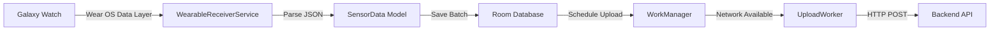

# Sensor Data Flow Documentation

This document describes the current watch-to-phone sensor data flow in the mobile app. This information will be useful for implementing the future "Logs/Docs" screen.

## Overview

The mobile app receives sensor data from the Galaxy Watch via the Wear OS Data Layer API. The data is stored locally in a Room database and periodically uploaded to a backend server.

## Data Flow Architecture



## Components

### 1. WearableReceiverService

**Location**: [WearableReceiverService.kt](file:///Users/teoechavarria/Documents/hh/hacking-health-app/app/src/main/java/com/samsung/android/health/sdk/sample/healthdiary/wearable/WearableReceiverService.kt)

**Purpose**: Receives sensor data batches from the watch via Wear OS Data Layer

**Key Features**:
- Listens for data changes on path `/sensor_batch`
- Receives batched sensor data as byte arrays
- Deserializes JSON to `List<SensorData>`
- Saves data to Room database via `SensorRepository`

**Data Path**: `/sensor_batch`

### 2. SensorData Model

**Location**: [SensorData.kt](file:///Users/teoechavarria/Documents/hh/hacking-health-app/app/src/main/java/com/samsung/android/health/sdk/sample/healthdiary/wearable/model/SensorData.kt)

**Structure**:
```kotlin
@Serializable
data class SensorData(
    val type: String,        // e.g., "accelerometer", "heart_rate", "gyroscope"
    val timestamp: Long,     // Unix timestamp in milliseconds
    val values: FloatArray   // Sensor values (x, y, z for accelerometer)
)
```

### 3. Room Database

**Location**: [AppDatabase.kt](file:///Users/teoechavarria/Documents/hh/hacking-health-app/app/src/main/java/com/samsung/android/health/sdk/sample/healthdiary/data/room/AppDatabase.kt)

**Entity**: [SensorDataEntity.kt](file:///Users/teoechavarria/Documents/hh/hacking-health-app/app/src/main/java/com/samsung/android/health/sdk/sample/healthdiary/data/room/SensorDataEntity.kt)

**DAO**: [SensorDataDao.kt](file:///Users/teoechavarria/Documents/hh/hacking-health-app/app/src/main/java/com/samsung/android/health/sdk/sample/healthdiary/data/room/SensorDataDao.kt)

**Purpose**: Local storage for sensor data before upload

### 4. SensorRepository

**Location**: [SensorRepository.kt](file:///Users/teoechavarria/Documents/hh/hacking-health-app/app/src/main/java/com/samsung/android/health/sdk/sample/healthdiary/data/repository/SensorRepository.kt)

**Responsibilities**:
- Save sensor data batches to Room database
- Schedule background upload via WorkManager
- Use `ExistingWorkPolicy.KEEP` to avoid duplicate uploads

### 5. UploadWorker

**Location**: [UploadWorker.kt](file:///Users/teoechavarria/Documents/hh/hacking-health-app/app/src/main/java/com/samsung/android/health/sdk/sample/healthdiary/worker/UploadWorker.kt)

**Purpose**: Background worker that uploads sensor data when network is available

**Constraints**:
- Requires network connectivity
- Runs as one-time work request
- Uses unique work name to prevent duplicates

## Sensor Types

Based on the watch app implementation, the following sensor types are collected:

1. **Accelerometer** (`type: "accelerometer"`)
   - 3-axis motion data (x, y, z)
   - Sampled at ~1 Hz
   - Batched every 30 seconds

2. **Heart Rate** (if implemented)
   - Single value per reading
   - Type: "heart_rate"

3. **Gyroscope** (if implemented)
   - 3-axis rotation data
   - Type: "gyroscope"

4. **HRV** (if implemented)
   - Heart rate variability metrics
   - Type: "hrv"

## Data Format

### Watch to Phone (Wear OS Data Layer)

```json
[
  {
    "type": "accelerometer",
    "timestamp": 1700000000000,
    "values": [0.5, -0.3, 9.8]
  },
  {
    "type": "accelerometer",
    "timestamp": 1700000001000,
    "values": [0.6, -0.2, 9.7]
  }
]
```

### Room Database Storage

The `SensorDataEntity` stores:
- `id`: Auto-generated primary key
- `type`: Sensor type string
- `timestamp`: Unix timestamp (Long)
- `values`: Comma-separated float values (String)

## Future Logs/Docs Screen

### Recommended Features

1. **Log Viewer**
   - Display recent sensor data batches
   - Filter by sensor type
   - Show timestamp and values
   - Export logs as JSON/CSV

2. **Connection Status**
   - Watch connection status
   - Last sync time
   - Number of pending uploads
   - Network status

3. **Statistics**
   - Total data points received
   - Data points per sensor type
   - Upload success/failure rate
   - Storage usage

4. **Debug Information**
   - Device ID
   - Watch IP address (if configured)
   - API endpoints
   - Configuration values

### Database Queries Needed

```kotlin
// Get recent sensor data
sensorDataDao.getRecentData(limit: Int): List<SensorDataEntity>

// Get data by type
sensorDataDao.getDataByType(type: String): List<SensorDataEntity>

// Get data count
sensorDataDao.getDataCount(): Int

// Get data by date range
sensorDataDao.getDataByDateRange(start: Long, end: Long): List<SensorDataEntity>

// Clear old data
sensorDataDao.deleteOlderThan(timestamp: Long)
```

## Configuration

The sensor data flow can be configured using the new config module:

- **Batch Size**: `AppConstants.SENSOR_BATCH_SIZE` (default: 100)
- **Upload Interval**: `AppConstants.SENSOR_UPLOAD_INTERVAL_MS` (default: 5 minutes)
- **Data Path**: `AppConstants.SENSOR_DATA_PATH` (default: "/sensor_batch")

## Notes

- No UI currently displays raw sensor data
- Data is only stored and uploaded, not visualized
- The infrastructure is ready for a Logs/Docs screen
- Consider adding data retention policies to prevent database bloat
